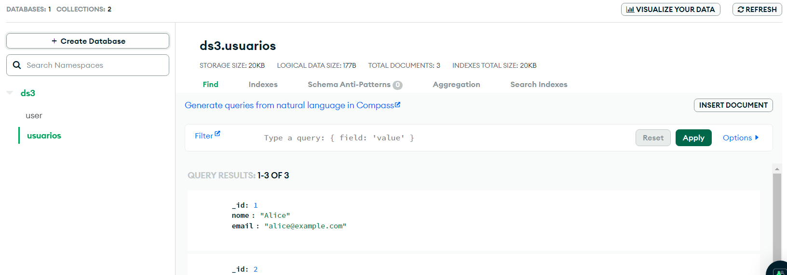

Criei uma aplicação REST simples que recebe um objeto json [MigrationRequest.java](src%2Fmain%2Fjava%2Fcom%2Fkainan%2Fmigration%2Fentities%2FMigrationRequest.java)
contendo
```json
"sqlDatabaseUrl": "string de conexão banco relacional",
"mongoUrl": "string de conexão mongodb",
"sqlDatabaseTable": "tabela a ser migrada",
"mongoCollection": "coleção para a qual vai ser migrada",
"mongoDatabase": "database da coleção"
```

Desenvolvi essa API com suporte aos bancos de dados Postgres e MySQL.

Segue o arquivo para criar os bancos de dados no docker: [docker-compose.yml](docker-compose.yml)

Na pasta [db](src%2Fmain%2Fjava%2Fcom%2Fkainan%2Fmigration%2Futils%2Fdb)  você vai encontrar os arquivos para teste, contendo a criação e inserção de dados nos respectivos bancos criados, e o json de migração para usar na API.

Evidência de execução


URL para uso: POST http://localhost:8082/migrate